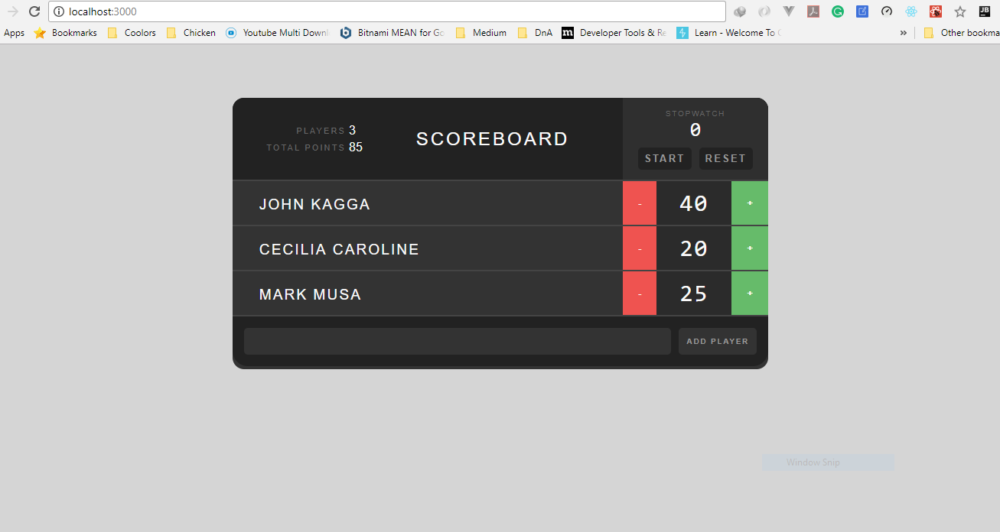

# Scoreboard - With Redux State management
This React application enables you to add a 
player and keep track of their scores. It also
provides a stop watch for counting the time a 
player takes to play a certain game.

## Screenshot of the app

*Note: I developed this using the [Treehouse](https://teamtreehouse.com/library/building-applications-with-react-and-redux) React
redux course.*

## Running the app
- Clone the application
- Run `npm install` to install all the dependencies
- Run `yarn start` to start the application server.

